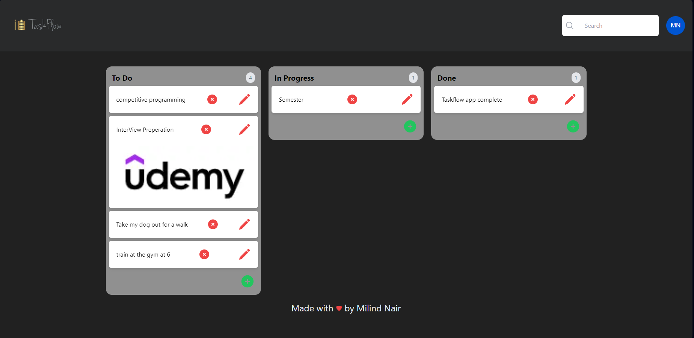
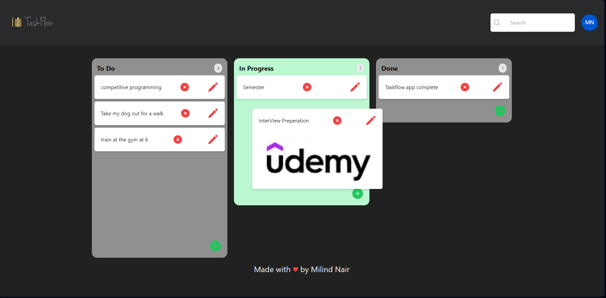

# TaskFlow - A Next.js Todo App (Trello-Clone)




TaskFlow is a feature-rich, responsive Todo web application built using Next.js, Headless UI, TypeScript, Appwrite, and React Beautiful DnD. It offers a user-friendly interface with functionalities like search, delete, add, drag-and-drop, and edit tasks. TaskFlow makes managing your tasks a breeze!

## Features

- **Todo Management**: Create, organize, and manage your tasks effortlessly.
- **Search Functionality**: Quickly find specific tasks using the search bar.
- **Delete Tasks**: Remove completed or unnecessary tasks with ease.
- **Add New Tasks**: Easily add new tasks to your list.
- **Drag-and-Drop**: Reorder tasks by simply dragging and dropping them.
- **Edit Tasks**: Edit

## Technologies Used

- Next.js
- Appwrite Cloud database
- Headless UI
- TailwindCss

## Getting Started

First, run the development server:

```bash
npm run dev
# or
yarn dev
# or
pnpm dev
```

Open [http://localhost:3000](http://localhost:3000) with your browser to see the result.

You can start editing the page by modifying `app/page.tsx`. The page auto-updates as you edit the file.

This project uses [`next/font`](https://nextjs.org/docs/basic-features/font-optimization) to automatically optimize and load Inter, a custom Google Font.

## Learn More

To learn more about Next.js, take a look at the following resources:

- [Next.js Documentation](https://nextjs.org/docs) - learn about Next.js features and API.
- [Learn Next.js](https://nextjs.org/learn) - an interactive Next.js tutorial.

You can check out [the Next.js GitHub repository](https://github.com/vercel/next.js/) - your feedback and contributions are welcome!

## Deploy on Vercel

The easiest way to deploy your Next.js app is to use the [Vercel Platform](https://vercel.com/new?utm_medium=default-template&filter=next.js&utm_source=create-next-app&utm_campaign=create-next-app-readme) from the creators of Next.js.

Check out our [Next.js deployment documentation](https://nextjs.org/docs/deployment) for more details.
